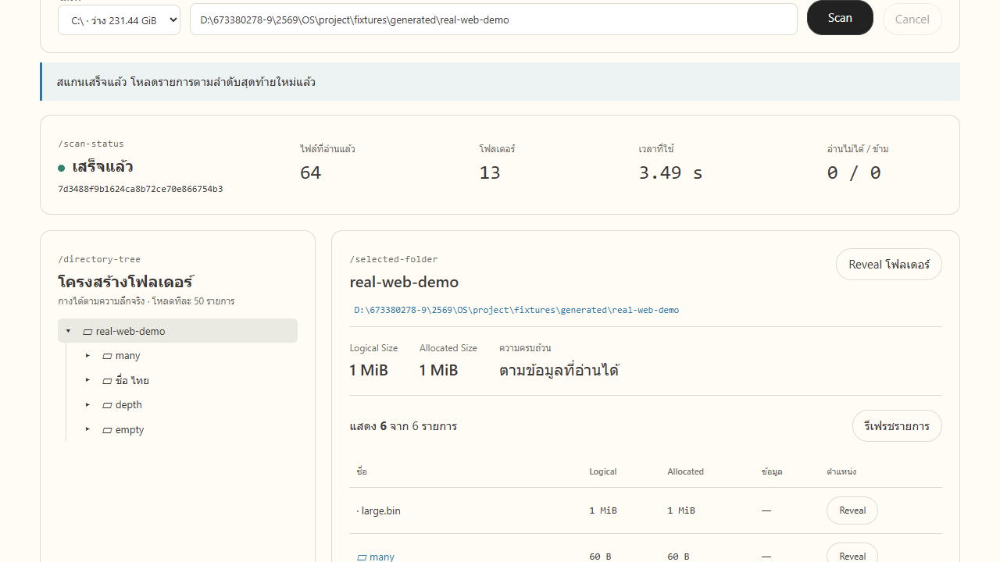

# CoreSpace

### ดูว่าไฟล์และโฟลเดอร์ใดใช้พื้นที่มาก

เว็บสำหรับสำรวจพื้นที่ไฟล์บน **Windows** เลือกโฟลเดอร์ กาง tree แล้วดูขนาดของไฟล์และโฟลเดอร์ข้างในได้ โดยทำงานบนคอมเครื่องเดียว

[เปิดใช้งาน](#เปิดใช้งาน) · [ผลตรวจจริง](docs/results/REAL_SCANNER_INTEGRATION.md) · [เอกสารของกลุ่ม](#เอกสารของกลุ่ม)

[](docs/results/real-web-root.png)

*ภาพจากการสแกนจริงบน Windows ผ่าน C ใน Ubuntu WSL ไม่ใช่ข้อมูลตัวอย่าง กดภาพเพื่อดูขนาดเต็ม*

## ใช้ทำอะไรได้บ้าง

- กางโฟลเดอร์ตามความลึกจริง และดูทั้งไฟล์กับโฟลเดอร์ในตาราง
- โหลดครั้งละ 50 รายการ แล้วกดแสดงเพิ่มเติมได้
- ดู **Logical Size** หรือขนาดเนื้อหาไฟล์ และ **Allocated Size** หรือพื้นที่ที่ Windows รายงานว่าไฟล์ใช้
- ดูจำนวนรายการระหว่างสแกน ยกเลิกงาน และเปิดผลที่เก็บไว้กลับมาดู
- ดูเหตุผลที่อ่านไม่ได้หรือข้ามรายการ และกด **Reveal** เพื่อเปิดตำแหน่งใน Explorer

## เปิดใช้งาน

ต้องมี **Windows Python 3.10 ขึ้นไป** และ **Ubuntu ใน WSL** ที่มี `gcc` กับ `make` หน้าเว็บมี Vue และ CSS ในโปรเจกต์แล้ว ไม่ต้องติดตั้ง Node.js เพื่อเปิดงาน

### 1. เตรียมโปรแกรมอ่านไฟล์ใน Ubuntu

เปิด Ubuntu แล้วเข้าโฟลเดอร์โปรเจกต์ เปลี่ยน path ตัวอย่างให้ตรงกับที่เก็บงาน:

```bash
cd /mnt/d/path/to/miniprojectOS2026
make -C scanner
make -C scanner install
readlink -f ~/.local/bin/diskviz-scan
```

หากยังไม่มี compiler ให้ติดตั้ง `build-essential` ก่อน คำสั่งสุดท้ายจะแสดงตำแหน่งโปรแกรม เช่น `/home/student/.local/bin/diskviz-scan` ให้นำไปใช้ในขั้นต่อไป

### 2. เปิดเซิร์ฟเวอร์บน Windows

เปิด PowerShell ที่โฟลเดอร์โปรเจกต์ แล้วเปลี่ยนตำแหน่ง Python และ C ในตัวอย่างให้ตรงเครื่อง:

```powershell
.\tools\start.ps1 `
  -PythonPath 'C:\Python312\python.exe' `
  -ScannerWslPath '/home/student/.local/bin/diskviz-scan'
```

ถ้าเรียก `python` หรือ `py` ได้อยู่แล้ว สามารถละ `-PythonPath` ได้ เพิ่ม `-CheckOnly` เมื่อต้องการตรวจการตั้งค่าก่อนเปิด

### 3. เลือกโฟลเดอร์แล้วกด Scan

เปิด **http://127.0.0.1:8080** กรอกตำแหน่งโฟลเดอร์ Windows แล้วกด **Scan** ปิดเซิร์ฟเวอร์ด้วย **Ctrl+C**

ถ้าไม่ได้ตั้ง C โปรแกรมจะแจ้งข้อผิดพลาด ไม่สลับไปใช้ข้อมูลตัวอย่างเอง ดูตัวเลือกและวิธีเปิดเพิ่มเติมใน [คู่มือปวริศช์](docs/PAVARIT_HANDOFF.md)

## ทำงานอย่างไร

**C ใน Ubuntu WSL → Python บน Windows → เว็บในเบราว์เซอร์**

1. C อ่านชื่อ ชนิด และขนาดไฟล์ แล้วส่งข้อมูลให้ Python ทีละบรรทัด
2. Python วัดพื้นที่ด้วย Windows API รวมยอดโฟลเดอร์ และเก็บผลใน SQLite
3. เว็บขอสถานะและรายการที่กำลังดู จึงไม่ต้องโหลดผลทั้งไดรฟ์เข้าหน้าเว็บพร้อมกัน

นี่คือระบบส่งงานแนวทางเดียว โหมด `/?mock=1` และ `source: "sample"` มีไว้ตรวจแยกส่วน ขนาดในโหมดเหล่านั้นเป็นค่าจำลอง

## สถานะและข้อจำกัด

**รวมระบบหลักเข้า main แล้ว** ตรวจ C → Python → เว็บกับไฟล์จริงบนไดรฟ์ D ผ่าน รวม 64 ไฟล์/13 โฟลเดอร์ การแบ่งหน้า 50+10 ชื่อไทย โฟลเดอร์ลึก 8 ชั้น junction และการยกเลิก

- ชุดทดสอบบน Windows ผ่าน **24 ข้อ** ส่วน C tests **11 ข้อ** รันใน Ubuntu แยกและผ่านแล้ว
- ทดลองสแกนทั้งไดรฟ์ D และยกเลิกสำเร็จ **ยังไม่ได้รอจนจบทั้งไดรฟ์**
- อ่านบางรายการไม่ได้ ผลจะแสดง **ผลบางส่วน** ค่าที่ไม่ทราบเป็น `null` ไม่ใช่ศูนย์
- ยอดโฟลเดอร์เป็นผลรวมไฟล์ที่อ่านได้ อาจนับ hard link ซ้ำ และไม่เท่าพื้นที่ใช้ทั้งหมดของไดรฟ์
- ยังไม่ได้ยืนยันทุกกรณีสิทธิ์ NTFS หรือทดลองสแกนไดรฟ์ C ทั้งลูก

ดู [ผลตรวจและภาพจริง](docs/results/REAL_SCANNER_INTEGRATION.md) งานที่เหลือของกลุ่มคือซ้อมเปิดโปรแกรม ปิดรายงานและสไลด์ และเตรียมผลทั้งไดรฟ์เพิ่มหากต้องการนำเสนอ ไม่มีงาน benchmark เปรียบเทียบกับต้นแบบ

<details>
<summary>คำสั่งตรวจการเชื่อม C จริง</summary>

ใช้ Windows Python และเปลี่ยนชื่อผู้ใช้ Ubuntu ให้ตรงเครื่อง:

```powershell
python tools/run_checks.py --real-scanner-wsl-path '/home/student/.local/bin/diskviz-scan' --output docs/results/real-scanner-tests.txt
```

เพิ่ม `--drive 'D:\'` เมื่อต้องการตรวจสแกนและยกเลิกไดรฟ์จริง ชุดตรวจใช้ฐานข้อมูลชั่วคราว ส่วน `--wsl` ใช้เปิดการตรวจโปรแกรมจำลอง WSL เพิ่ม ดูเงื่อนไข fixture ใน [คู่มือ](docs/PAVARIT_HANDOFF.md)

ใน Ubuntu ที่โฟลเดอร์โปรเจกต์:

```bash
python3 -m unittest tests.test_c_scanner -v
```

</details>

## เอกสารของกลุ่ม

| ต้องการดู | เอกสาร |
| --- | --- |
| ข้อกำหนดและข้อมูลที่ส่งระหว่างโปรแกรม | [SPEC](docs/SPEC.md) · [CONTRACT](docs/CONTRACT.md) |
| หน้าที่และลำดับรวมงาน | [แผนกลุ่ม](docs/PROJECT_PLAN.md) · [แผนวันเดียว](docs/ONE_DAY_PLAN.md) |
| เปิดระบบและผลส่วนปวริศช์ | [คู่มือ](docs/PAVARIT_HANDOFF.md) · [บันทึกรายงาน](docs/PAVARIT_REPORT_NOTES.md) |
| เตรียมพูดและเดโม | [แผนนำเสนอ](docs/PRESENTATION_PLAN.md) · [บทเดโม](docs/THEERAMET_DEMO_SCRIPT.md) |
| ความรู้ OS และซ้อมตอบคำถาม | [เนื้อหา OS](docs/OS_CONCEPTS_EXPLAINED.md) · [แนวคำถาม](docs/STUDY_GUIDE.md) |
| หน้าตาเว็บและประวัติ | [DESIGN](docs/DESIGN.md) · [CHANGELOG](docs/CHANGELOG.md) |

เอกสารต้นแบบเก่าอยู่ใน [docs/archive](docs/archive/HANDOFF.md) ตำรา PDF ใน `docs/reference/` ไม่เก็บใน Git

## สมาชิก

กลุ่ม **ผู้ก้าวข้ามโชคชะตาด้วยมือของตัวเอง** · หัวข้อ **Disk Space Visualization**

- **นายศรัณย์ พาพรชัย** · 673380515-5 — C และ POSIX อ่านไฟล์
- **นายปวริศช์ ประมวล** · 673380278-9 — Python เชื่อมระบบและวัดพื้นที่บน Windows
- **นายธีรเมธ สายคำ** · 673380273-9 — เว็บ สไลด์ และการสาธิต

นำเสนอ **9 ตุลาคม 2569 เวลา 13:00 น.** ใช้เวลา **5–10 นาที**
